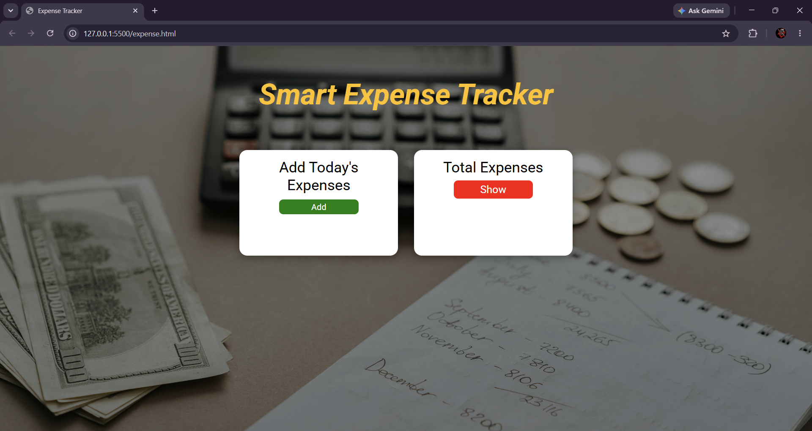
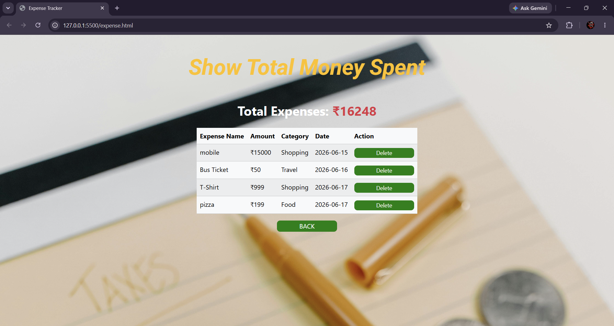

# Smart Expense Tracker

A responsive web application for tracking daily expenses, built using HTML, CSS, Bootstrap, and JavaScript.

## Features

- Add daily expenses
- View all expenses in a tabular format
- Delete expenses
- Categorize expenses (Food, Travel, Shopping)
- Calculate total expenses automatically
- Local Storage support
- Responsive and user-friendly interface

## Technologies Used

- HTML5
- CSS3
- Bootstrap 5
- JavaScript (ES6)
- Local Storage

## Project Screenshots

### Home Page



### Expense Summary



## Folder Structure

```text
Smart-Expense-Tracker
│
├── index.html
├── style.css
├── script.js
├── README.md
│
├── images
│   ├── home-bg.jpg
│   └── expense-bg.jpg
│
└── screenshots
    ├── home.png
    └── summary.png
```

## How to Run

1. Clone the repository:

```bash
git clone <repository-url>
```

2. Open the project folder.

3. Open `index.html` in your browser.

4. Start managing your daily expenses.

## Future Enhancements

- User Login & Signup
- Expense Analytics Dashboard
- Monthly Expense Reports
- Charts and Graphs
- Backend Integration using Node.js and MongoDB
- Expense Filtering and Search

## Author

**M Abhilash Reddy**

B.Tech – Computer Science and Engineering